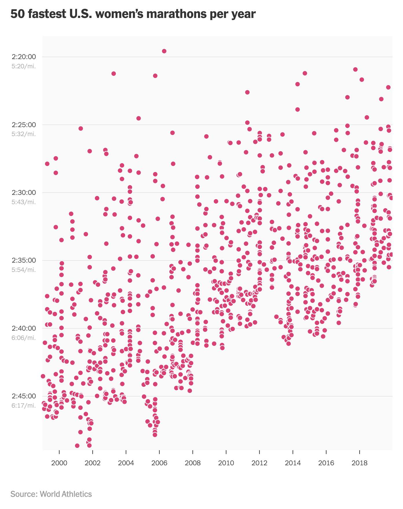

# Why Are American Women Running Faster Than Ever?

This repository contains code in R to replicate the following graphic:

  

## Source

- Title: **Why Are American Women Running Faster Than Ever? We Asked
  Them—Hundreds of Them**

- Author(s): Talya Minsberg and Kevin Quealy

- Date: Feb 28, 2020

- From: New York Times

- URL:
  <https://www.nytimes.com/interactive/2020/02/28/sports/womens-olympic-marathon-trials.html>

- PDF:
  [Why-Are-American-Women-Running-Faster-Than-Ever-NYT.pdf](source/Why-Are-American-Women-Running-Faster-Than-Ever-NYT.pdf)

## Data

The source of the data (i.e. marathoners times) is *World Athletics*:
<https://worldathletics.org/>.

Specifically, the women’s marathon times (dating back to 2001) are
available in the following webpage:

<https://worldathletics.org/records/toplists/road-running/marathon/all/women/senior/2001?regionType=world&page=1&bestResultsOnly=true&maxResultsByCountry=all&eventId=10229534&ageCategory=senior>

Note that the data collection involves web crawling and scraping several
pages from the above website.

All the R code used for this task is in the script
`web-scraping-world-athletrics.R`, located in the folder `data/` of this
repository.

In this `data/` folder, you’ll find various HTML files of the form
`marathon-women-yyyy.html` where `yyyy` indicates a given year from 2001
to 2024.
